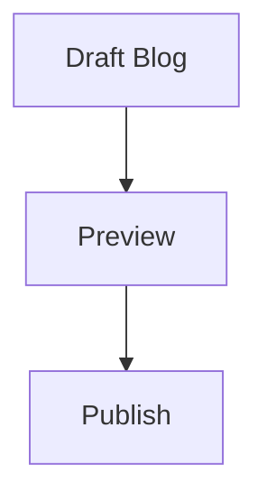

# Portfolio & CMS Platform

A full-stack personal portfolio with a React public site, a FastAPI content API, and a protected admin dashboard. Content, projects, blogs, experience, and contact messages are managed through the backend rather than hard-coded into the deployed site.

**Live site:** [rishabh-surana.netlify.app](https://rishabh-surana.netlify.app/)

---

## Highlights

- Glassmorphism portfolio UI with responsive project, achievement, and education sections.
- Database-backed content and a protected admin dashboard for managing portfolio data.
- Blog Markdown reader supports Mermaid diagrams with in-modal zoom controls.
- Contact messages are saved to the backend inbox first, then optionally sent as SMTP email alerts without delaying the visitor's success state.
- Responsive contact notification emails with a clear subject, reply-to support, and received time shown in IST.
- Consent-based visitor location context: the form resolves the visitor's city and includes it in the email only when browser location permission is granted.
- Analytics, rate limiting, JWT admin authentication, and password hashing.

---

## Tech Stack

| Area     | Tools                                                                                    |
| -------- | ---------------------------------------------------------------------------------------- |
| Frontend | React 19, Vite, React Router, Framer Motion, Axios, React Icons, React Markdown, Mermaid |
| Backend  | FastAPI, SQLAlchemy, Uvicorn, Pydantic                                                   |
| Data     | SQLite for local development, PostgreSQL for production                                  |

---

## Blog Markdown & Mermaid

Blog content is authored as Markdown through the CMS and rendered in the public blog modal. Standard Markdown code blocks continue to render as code, while fenced `mermaid` blocks are rendered as diagrams.

Example:

````md

````

Rendered Mermaid diagrams include zoom out, reset, and zoom in controls inside the diagram box, with scroll support for larger diagrams.

---

## Contact Email Notifications

Each contact submission is persisted in the backend inbox. SMTP alerts are optional and run in a background thread, so email delivery does not hold up the form response.

---

## Visitor Location Context

The contact form requests browser geolocation automatically. When permission is granted, it resolves the city, region, and country through the backend's reverse-geocoding endpoint and displays the detected city in the form. The email alert includes the location context and a map link; it is not stored with the contact message in the database.

When permission is denied or unavailable, no location context is submitted.

---

`Creating, Learning, and Evolving`
